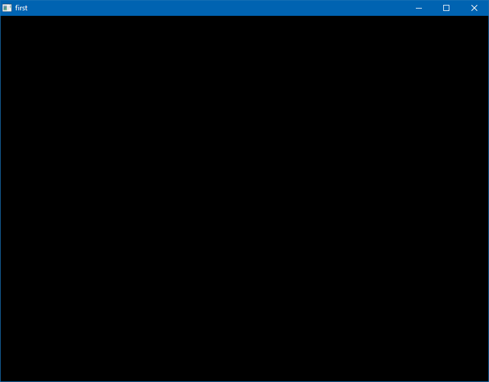

# 1. Your first OpenB3D program

You've just reached the first (well, actually the second) part of your FreeBasic + OpenB3D journey. In this part, you program your first 3D scene.

### The code

Fire up your editor and enter the following code:

	#include "openb3d.bi"
	#include "fbgfx.bi"

	using FB

	ScreenRes(800, 600, 32,, GFX_OPENGL)
	Graphics3D(800, 600, 32)

	Do
		UpdateWorld()
		RenderWorld()
		
		Flip()
	Loop Until MultiKey(SC_ESCAPE)

### Compiling and running

Save the file as `first.bas` into your working directory and open the command prompt. Navigate to your working directory you created earlier. If your working directory path is `C:\Users\YOUR_USERNAME_HERE\openb3d\`, for instance, enter `cd openb3d`. Now run `fbc first.bas`. If you followed all of the previous steps there should be no errors. Now launch the executable via the command prompt or just double-click it in Explorer.

You should see something like this:

*to be continued...*

[Previous: Introduction](intro.md)
[Next: A light, a camera and a cube](basic.md)